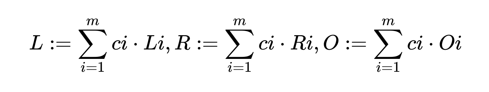

# ZKP Theory / Zokrates

Topics:
 - Cryptography : FHE
 - Complexity Theory
 - ZKP Theory - zkSNARKS
 - Zokrates
 - zkSNARK process in more details

## FHE

### Background

Fully Homomorphic Encryption , the ‘holy grail’ of cryptography, is a form of encryption that allows
arbitrary computations on encrypted data. This field is not specific to the ZK area but is a helpful tool to ZK.

We encrypt some data => send it off to a third-party to do some operation/computation (maybe they have more resources) => third-party sends it back to us => we decrypt the data

Here the thid-party does not learn anything about the encrypted data. 

Homomorphic encryption can be viewed as an extension of either symmetrickey or public-key cryptography.

### Bitcoin split-key vanity mining

A vanity address is an address generated from parameters such that the resultant hash contains a human-readable string (e.g., 1BoatSLRHtKNngkdXEeobR76b53LETtpyT). This allows people to create addresses with some numbers or letters they might want. 

Given that ECDSA key pairs have homomorphic properties for addition and multiplication, one can
outsource the generation of a vanity address without having the generator know the full private key
for this address.

For example:

1. Alice generates a private key (a) and public key (A) pair, and publicly posts A.
2. Bob generates a key pair (b, B) such that hash(A + B) results in a desired vanity address. He sells b and B to Alice.
3. A, B, and b are publicly known, so one can verify that the address = hash(A + B) as desired.
4. Alice computes the combined private key (a + b) and uses it as the private key for the public key (A
+ B).
5. Similarly, multiplication could be used instead of addition.

Although private key **b** is publicly known, the generator does not know the full private key for **(A + B)** due to private key **a** still being only known to alice. 

## Complexity Theory

Complexity theory is to classify how difficult problems are to solve and verify. Computer scientists and mathematicians haev tried to group problems that have similar properties into classes. Usually they are classified according to the time required to find/verify a solution or maybe even the amount of memory involved in finding/verifying the solution. 

If the time taken in the worst case grows as a polynomial of n, that is roughly proportional to $n^k$ for some value $k$, we put these problems in class P for polynomial. These problems are seen as
tractable.

Decision Problem: A problem with a yes or no answer

### Complexity Classes

#### P

P is a complexity class that represents the set of all decision problems that can be solved in
polynomial time. That is, given an instance of the problem, the answer yes or no can be decided in
polynomial time.

The polynomial refers to the size of the input.

#### NP

NP is a complexity class that represents the set of all decision problems for which the instances
where the answer is “yes” have proofs that can be verified in polynomial time, even though the
solution may be hard to find.

#### NP-Complete

NP-Complete is a complexity class which represents the set of all problems X in NP for which it is
possible to reduce any other NP problem Y to X in polynomial time.

Intuitively this means that we can solve Y quickly if we know how to solve X quickly.

#### NP-hard

Intuitively, these are the problems that are at least as hard as the NP-complete problems. Note that
NP-hard problems do not have to be in NP, and they do not have to be decision problems.

The precise definition here is that a problem X is NP-hard, if there is an NP-complete problem Y,
such that Y is reducible to X in polynomial time

#### IP

A class that lies at the heart of zkps is the Interactive Proof class.

In complexity theory they are related to the other complexity classes

### Big O Notation

In plain words, Big O notation describes the complexity of your code using algebraic terms.
It describes the time or space required to solve a problem in the worse case in terms of the size of
the input.

We use this notation when comparing ZKP systems

## ZKP Theory - zkSNARKs

Currently zkSNARKS are the most common proof system being used, for example they form the
basis for the privacy provided in ZCash.

The process of creating and using a zk-SNARK can be summarised as

A zk-SNARK consists of three algorithms $C, P, V$ defined as follows:

The Creator takes a secret parameter lambda (secret randomness) and a program $C$, and generates two publicly available keys (pieces of data we create in a setup):
 - a proving key $pk$
 - a verification key $vk$

These keys are **public parameters** that only need to be generated once for a given program C.
They are also known as the Common Reference String.

### Process of creating/verifying a proof

The prover Peggy takes a proving key $pk$, a public input $x$ and a private witness $w$.

Peggy generates a proof $pr = P(pk, x, w)$ that claims that Peggy knows a witness $w$ and that the
witness satisfies the program $C$.

The verifier Victor computes $V (vk, x, pr)$ which returns true if the proof is correct, and false
otherwise.

Thus this function returns true if Peggy knows a witness $w$ satisfying:

$C(x, w) = true$

### Trusted Setups and Toxic Waste

Note the secret parameter lambda in the setup, this parameter sometimes makes it tricky to use zkSNARK in real-world applications. The reason for this is that anyone who knows this parameter can
generate fake proofs.

Specifically, given any program $C$ and public input $x$ a person who knows lambda can generate a
proof $pr2$ such that $V (vk, x, pr2)$ evaluates to true without knowledge of the secret $w$.

Usually, a multi-party computation (MPC) ceremony is used for the setup.

### Polynomials in ZKPs

First part is called Arithmetization, where we take some code to transform that in a number of ways into a polynomial, which helps us verify whether a proof is correct or not. 

If a prover claims to know some polynomial (no matter how large its degree is) that the verifier also
knows, they can follow a simple protocol to verify the statement:

1. Verifier chooses a random value for x and evaluates his polynomial locally
2. Verifier gives x to the prover and asks to evaluate the polynomial in question
3. Prover evaluates her polynomial at x and gives the result to the verifier
4. Verifier checks if the local result is equal to the prover’s result, and if so then the statement is proven with a high confidence

The reason the statement is proven with a high confidence is due to Schwartz-Zippel Lemma. If polynomials are not equal, it is very unlikely they are going to evaluate to the same thing at a point. It becomes further unlikely if the verifier chooses the value x randomly from a very large field.

Note that Schwartz-Zippel Lemma is interactive. We'll see how we can squash up our proof to make it non-interactive. In the above example, it is easier to think about the internal process between the prover and verifier when it is interactive. 

### Homomorphic Hiding

Another technique we use to hide information but still do evaluation is homomorphic hiding. 

If $E(x)$ is a function with the following properties:

 - Given $E(x)$ it is hard to find $x$
 - Different inputs lead to different outputs so if $x ≠ y$, $E(x) ≠ E(y)$
 - Homomorphic aspect - We can compute $E(x + y)$ given $E(x)$ and $E(y)$

The group $Z^*_p$ with operations addition and multiplication allows this.

Here’s a toy example of why Homomorphic Hiding is useful for Zero-Knowledge proofs: Suppose
Alice wants to prove to Bob she knows numbers $x,y$ such that $x + y = 7$

1. Alice sends $E(x)$ and $E(y)$ to Bob.
2. Bob computes $E(x + y)$ from these values (which he is able to do since $E$ is an HH).
3. Bob also computes $E(7)$, and now checks whether $E(x + y) = E(7)$. He accepts Alice’s proof
only if equality holds.

## Zokrates - a toolbox for zkSNARKs on Ethereum

Zokrates was the first project to allow (easy) creation of proofs on Ethereum. ZoKrates helps you use verifiable computation in your DApp, from the specification of your program in a high level language to generating proofs of computation to verifying those proofs in Solidity.

Documentation [here](https://zokrates.github.io/) and [repo](https://github.com/Zokrates/ZoKrates).

Workflow in Zokrates:

1. The Creator writes and compiles a program in the Zokrates DSL
2. The Creator / Prover generates a trusted setup for the compiled program
3. The Prover computes a witness for the compiled program
4. The Prover generates a proof - Using the proving key, she generates a proof for a computation of the compiled program
5. The Creator / Prover exports a Verifier - Using the verifying key she generates a Solidity
contract which contains the generated verification key and a public function to verify a solution
to the compiled program

## zkSNARK Process

This section will talk about the proof-creation process after the proving system is setup and what actually happens on the inside when we create that proof.

### General Process

 - Arithmetisation
   - Flatten code
   - Arithmetic Circuit
 - Polynomials
 - Polynomial Commitment Scheme (ability for the prover to have a polynomial without giving away too much information to the verifier)
 - Cryptographic proving system (interactive part of the process - prover and verifier go back and forth, where verifier is checking the proof is correct by checking the polynomial) 
 - Make non interactive (squash down the back and forth interactive process into a single step)

### Transformations in SNARKS

It is useful to think about the above process as a number of transformations. Basically, the process of creating a proof really is a process of doing some transformations.

A diagram showing the transformations for early versions of SNARKS:

Computation => Algebraic Circuit => R1CS (code to polynomial process) => QAP (polynomial) => Linear PCP => Linear Interactive Proof (proving part) => zkSNARK

While we do all these transformations, we want to be sure we're not losing the integrity of what we're doing. 

1. A High Level description / program is turned into an arithmetic circuit (normally it is a compiler doing this process e.g. Zokrates compiler).

The creator of the zkSNARK uses a high level language to specify the algorithm that
constitutes and tests the proof.

This high level specification is compiled into an arithmetic circuit.

An arithmetic circuit can be thought of as similar to a physical electrical circuit consisting of
logical gates and wires. This circuit constrains the allowed inputs that will lead to a correct
proof.

2. Further Mathematical refinement
   
The circuit is then turned into a an R1CS, and then a series of formulae called a Quadratic
Arithmetic Program (QAP) (Polynomial).

The QAP is then further refined to ensure the privacy aspect of the process.

The end result is a proof in the form of series of bytes that is given to the verifier. The verifier
can pass this proof through a verifier function to receive a true or false result.

There is no information in the proof that the verifier can use to learn any further information
about the prover or their witness.

### Transforming our code into a polynomial

Lets look first at transforming the problem into a QAP, there are 3 steps:
 - code flattening
 - creation of an arithmetic circuit
 - conversion to a rank-1 constraint system (R1CS)

#### Code Flattening

We are aiming to create arithmetic and / or boolean circuits from our code, so we change the high
level language into a sequence of statements that are of two forms.

x = y (where y can be a variable or a number)

and

x = y (op) z

(where op can be +, -, ∗, / and y and z can be variables, numbers or themselves subexpressions).

For example we go from,
```
def qeval(x):
 y = x**3
 return x + y + 5
```
to
```
sym_1 = x * x
y = sym_1 * x
sym_2 = y + x
~out = sym_2 + 5
```

#### Arithmetic Circuit

This is a collection of gates performing arithmetic operations.

#### Rank 1 Constraint Systems

Constraint languages can be viewed as a generalization of functional languages:

 - everything is referentially transparent and side-effect free
 - there is no ordering of constraints
 - composing two R1CS programs just means that their constraints are simultaneously satisfied.

The important thing to understand is that a R1CS is not a computer program, you are not asking it
to produce a value from certain inputs. Instead, a R1CS is more of a verifier, it shows that an
already complete computation is correct.

[See Constrain Systems for ZK SNARKs](https://coders-errand.com/constraint-systems-for-zk-snarks/)

The arithmetic circuit is a composition of multiplicative sub-circuits (a single multiplication gate and multiple addition gates). A rank 1 constraint system is a set of these subcircuits expressed as constraints, each of the form:

$AXB = C$

where $A, B, C$ are each linear combinations $c1·v1+ c2· v2+ ...$

The $c_i$ are constant field elements, and the $v_i$ are instance or witness variables (or 1).

$AXB = C$ doesn't mean $C$ is computed from $A$ and $B$ just that $A, B, C$ are consistent.

More generally, an implementation of $x = f(a, b)$ doesnʼt mean that $x$ is computed from $a$ and $b$, just that $x$, $a$, and $b$ are consistent.

Thus our R1CS contains:
1. the constant 1
2. all public inputs
3. outputs of the function
4. private inputs
5. auxilliary variables

The R1CS has:
1. one constraint per gate;
2. one constraint per circuit output.

Example:

Assume Peggy wants to prove to Victor that she knows $c1, c2, c3$ such that $(c1 ⋅ c2) ⋅ (c1 + c3) = 7$.

A legal assignment for the circuit is of the form:

$(c1, . . . , c5)$, where $c4 = c1 · c2$ and $c5 = c4 · (c1 + c3)$.

### SNARK Process continued

#### From R1CS to QAP

The next step is taking this R1CS and converting it into QAP form, which implements the exact same logic except using polynomials instead of dot products.

To create the polynomials we can use interpolation of the values in our R1CS. Then instead of checking the constraints in the R1CS individually, we can now check **all of the constraints at the same time** by doing the dot product check **on the polynomials**.

Because in this case the dot product check is a series of additions and multiplications of polynomials, the result is itself going to be a polynomial. If the resulting polynomial,
evaluated at every x coordinate that we used above to represent a logic gate, is equal to zero, then that means that all of the checks pass; if the resulting polynomial evaluated at at least one of the x coordinate representing a logic gate gives a nonzero value, then that means that the values going into and out of that logic gate are inconsistent.

#### How having polynomials helps us

We can change the problem into that of knowing a polynomial with certain properties
[This paper](https://arxiv.org/pdf/1906.07221.pdf) gives a reasonable explanation of how the polynomials are used to prevent the prover 'cheating'. We converted a set of vectors into polynomials that generate them when evaluated at certain fixed points. We used these fixed points to generate a vanishing polynomial that divides any polynomial that evaluates to 0 at least on all those points. We created a new polynomial that summarizes all constraints and a particular assignment, and the consequence is that we can verify all constraints at once if we can divide that polynomial by the vanishing one without remainder. This division is complicated, but there are methods (the Fast Fourier Transform) that can perform it efficiently.

From our QAP we have,



where L = represenation of left gates, R = represenation of right gates, O = represenation of output gates

and we define the polynomial $P$,

$P := L ⋅ R − O$ (derived from $L . R = O$ => $L . R - O = 0$, equal to 0 since polynomial should be zero for all of our gates).

#### [Referring to Lesson 12](../week-3/lesson-12.md/#idealized-proving-system)

Now we can start to do some of the techniques/properties discussed in Lesson 12 under the heading Idealized Proving system.

Let's say the prover is effectively saying that they know a polynomial which satisfies the above equation $P := L ⋅ R − O$ where $P$ evaluates to 0 for all of these $L$, $R$ and $O$ gates. 

The verifier is going to test (for all gates) this claim the prover is making with the help of these techniques/properties.

### So how does the Verifier go on about performing this test?

Defining the target polynomial:

$V(x) := (x − 1) ⋅ (x − 2). . .,$

This will be zero at the points that correspond to our gates, but the $P$ polynomial, having all the constraints information would be a some multiple of this if:
 - it is also zero at those points
 - to be zero at those points, L ⋅ R − O must equate to zero, which will only happen if our constraints are met

So we want $V$ to divide $P$ with no remainder, which would show that $P$ is indeed zero at the points.

If Peggy has a satisfying assignment it means that, defining $L,R,O,P$ as above, there exists a polynomial $P′$ such that:

$P = P′.V$

Suppose now that Peggy doesnʼt have a satisfying witness, but she still constructs $L, R, O, P$ as above from some unsatisfying assignment $(c1,…,cm)(c1,…,cm)$. Then we are guaranteed that $V$ does not divide $P$.

This means that for any polynomial $V$ of degree at most d − 2, P and $L, R, O, V$ will be different polynomials. Note that $P$ here is of degree at most 2(d − 1), $L, R, O$ here are of degree at most d − 1 and $V$ here is degree at most d − 2.

Remember the Schwartz-Zippel Lemma tells us that two different polynomials of degree at most d can agree on at most d points.

From here onwards, Homomorphic Hiding can be further applied on the polynomials so that the prover does not learn about the verifier's randomness (when testing) and the verifier does not learn about prover's input.
