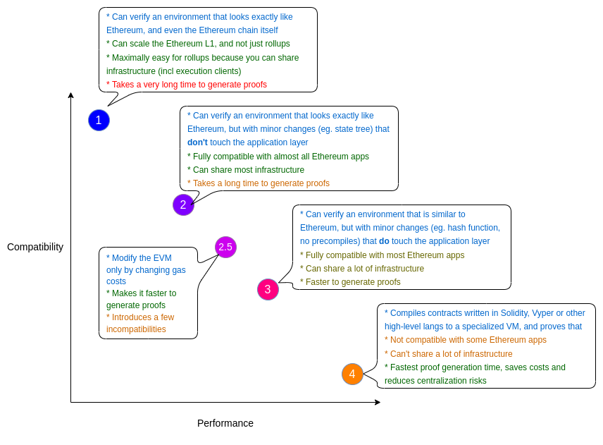

# zkEVM Solutions

Compared to Starknet, zkEVM solutions i.e. the L2 chains are trying to maintain max EVM compatibility. 

## Rollup Recap

Rollups are solutions that have:
 - transaction execution outside layer 1
 - transaction data and proof of transactions is on layer 1
 - a rollup smart contract in layer 1 that can enforce correct transaction execution on layer 2 by
using the transaction data on layer 1

The main chain holds funds and commitments to the side chains.
The side chain holds additional state and performs execution.
There needs to be some proof, either a fraud proof (Optimistic) or a validity proof (zk).

Rollups require “operators” to stake a bond in the rollup contract. This incentivises operators to
verify and execute transactions correctly.

## zkVM Introduction

### Background - Virtual Machines

Virtual Machines (VMs) are designed to provide the functionality a computer, usually wholly in software (there is a subtle difference between virtualisation and emulation). The Instruction Set Architecture (ISA) is part of the abstract model of a computer that defines how the CPU is controlled by the software.

There are 3 main types , register based, stack based and accumulator based, most VMs are of the
first 2 types. The Ethereum Virtual Machine is stack based.

In this course we will look at zkEVMs such as Polygon zkEVM / zkSync Era, and also zkVMs such
as Risc zero. Essentially, zkEVM is a subset of zkVM. 

A zkVM is a zero-knowledge proof-based virtual machine that combines a zk proof and a Virtual
Machine. The zkVM typically consists of two important components: a compiler that can compile
high-level languages such as C++ and Rust into intermediate (IR) expressions for the ZK system to
perform; the other is the ISA (Instruction Architecture) instruction set framework, which mainly
executes instructions about CPU operations and is a series of instructions used to instruct the CPU
to perform operations.

### zkEVM phases

#### Proof focused

 - Circuit creation
 - Setup
    - Parameters created - gives proving key and verification key
 - Proof creation
 - Proof aggregation
 - Proof acceptance on L1 and verification

#### L2 aspects

As we have seen for validity rollups, we also have processes to:

 - Submit data to the DA layer
 - Allow L1 <-> L2 messaging
 - Provide an escape hatch via forced transactions

## zkEVM workflow

The general workflow for an zkEVM would be:

 - Receive a transaction
 - Execute the relevant bytecode
 - Make state changes and transaction receipts
 - Using the zkEVM circuits with the execution trace as input produce a proof of correct execution
 - Aggregate proofs for a bundle of transactions and submit them to L1
 - Submit data to the appropriate data availability layer.

## Types of zkEVM

## zkSync 

[Link](https://docs.zksync.io/build)

## Polygon

[Polygon ZK Rollups](https://www.alchemy.com/overviews/polygon-zk-rollups)

[Strategy](https://polygon.technology/blog/polygons-zero-knowledge-strategy-explained)

Summary:
 - Polygon Edge - Infrastructure
 - Polygon PoS - Original side chain
 - Polygon zkEVM - zkEVM based rollup
 - Polygon CDK - App chain development
 - Polygon Miden - zkVM using STARKs

[Vision & Proposed Architecture](https://polygon.technology/blog/polygon-2-0-protocol-vision-and-architecture)

### Polygon Nightfall

From a collaboration with EY it is designed to allow private transactions. It is a combination Optimistic rollups and zero knowledge, optimistic rollups for scalability and zk for privacy.

There is a beta version available on mainnet.

## Scroll

[Link](https://scroll.io/blog/zkevm)

[Scroll Architecture](https://scroll.mirror.xyz/nDAbJbSIJdQIWqp9kn8J0MVS4s6pYBwHmK7keidQs-k)

### Components

The Sequencer provides a JSON-RPC interface and accepts L2 transactions. Every few seconds,
it retrieves a batch of transactions from the L2 mempool and executes them to generate a new L2
block and a new state root.

Once a new block is generated, the Coordinator is notified and receives the execution trace of this
block from the Sequencer.

It then dispatches the execution trace to a randomly-selected Roller from the roller pool for proof
generation.

The Relayer watches the bridge and rollup contracts deployed on both Ethereum and Scroll. It has
two main responsibilities.
1. It monitors the rollup contract to keep track of the status of L2 blocks including their data
availability and validity proof.
2. It watches the deposit and withdraw events from the bridge contracts deployed on both
Ethereum and Scroll and relays the messages from one side to the other.

### Rollers - creating proofs

The Rollers serve as provers in the network that are responsible for generating validity proofs for
the zkRollup

 - A Roller first converts the execution trace received from the Coordinator to circuit witnesses.
 - It generates proofs for each of the zkEVM circuits.
 - Finally, it uses proof aggregation to combine proofs from multiple zkEVM circuits into a
single block proof.

The Rollup contract on L1 receives L2 state roots and blocks from the Sequencer.

It stores state roots in the Ethereum state and L2 block data as Ethereum calldata.

This provides data availability for Scroll blocks and leverages the security of Ethereum to ensure
that indexers including the Scroll Relayer can reconstruct L2 blocks.

Once a block proof establishing the validity of an L2 block has been verified by the Rollup contract,
the corresponding block is considered finalized on Scroll.

L2 blocks in Scroll are generated, committed to base layer Ethereum, and finalized in the following
sequence of steps:
1. The Sequencer generates a sequence of blocks. For the i-th block, the Sequencer generates
an execution trace T and sends it to the Coordinator. Meanwhile, it also submits the
transaction data D as calldata to the Rollup contract on Ethereum for data availability and the
resulting state roots and commitments to the transaction data to the Rollup contract as state.
2. The Coordinator randomly selects a Roller to generate a validity proof for each block trace. To
speed up the proof generation process, proofs for different blocks can be generated in parallel
on different Rollers.
3. After generating the block proof P for the i-th block, the Roller sends it back to the
Coordinator. Every k blocks, the Coordinator dispatches an aggregation task to another Roller
to aggregate k block proofs into a single aggregate proof A.
4. Finally, the Coordinator submits the aggregate proof A to the Rollup contract to finalize L2
blocks i+1 to i+k by verifying the aggregate proof against the state roots and transaction data
commitments previously submitted to the rollup contract.

### Scroll circuit design

1. We need an accumulator to provide the proofs of storage, merkle trees can provide this
2. The execution trace is needed to show the path that the execution took through the bytecode,
as this would change because of jumps. This trace is then a witness provided to the circuit.
3. Two proofs are used to show the execution is correct for each opcode
4. Proof of fetching the data required for the opcode
5. Proof that the opcode executed correctly

Scroll are working with Ethereum on this, see this [repo](https://github.com/privacy-scaling-explorations/zkevm-circuits) for EVM circuit design, and this design
[document](https://hackmd.io/Hy_nqH4yTOmjjS9nbOArgw?view) from Ethereum.

[Mindset behind Scroll](https://hackmd.io/@yezhang/B167uMZRs)

## Taiko

[Type 1 ZK-EVM](https://taiko.mirror.xyz/w7NSKDeKfJoEy0p89I9feixKfdK-20JgWF9HZzxfeBo)

[Taiko Docs](https://docs.taiko.xyz/start-here/getting-started)

## Kakarot

[Link](https://www.kakarot.org/#Understanding)

## Linea

[Link](https://linea.build/)

