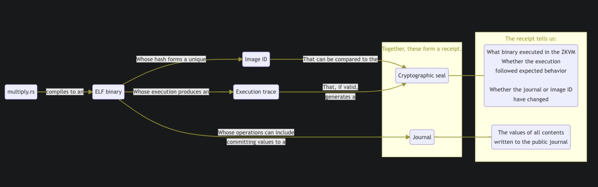

# Risc Zero / Axiom / Circom

## Risc0

[Link](https://www.risczero.com/)

The docs describe the process better, so I will not be writing specific notes for this section. The whole process though can summarized through the below diagram:

[Link to Bonsai](https://dev.bonsai.xyz/litepaper)

## Powdr

[Link](https://docs.powdr.org/)

## Axiom

[Link](https://demo.axiom.xyz/account-age)

## Circom

[Link](https://docs.circom.io/)

[zkRepl for Circom](https://zkrepl.dev/)