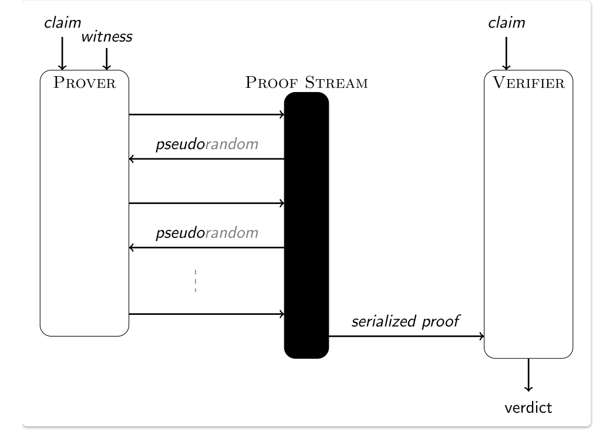

# zkSNARK theory / PLONK

Topics:
 - Polynomial Introduction
 - Polynomial Commitment Schemes
 - Proving Systems in general
 - zkSNARK process
 - Plonkish protocols

## Polynomial Introduction

[Same as from 3.7 to 3.11 from Lesson 1](https://github.com/mcgrathcoutinho/zk-encode/blob/main/week-1/lesson-1.md#37-polynomial-introduction)

## Polynomial Commitment Schemes

### Introduction

A polynomial commiment is a short object that "represents" a polynomial, and allows you to verify evaluations of that polynomial, without needing to actually contain all of the data in the polynomial.

That is, if someone gives you a commitment $c$ representing $P(x)$, they can give you a proof that can convince you, for some specific $z$, what the value of $P(z)$ is. There is a further mathematical result that says that, over a sufficiently big field, if certain kinds of equations (chosen before $z$ is known) about polynomials evaluated at a random $z$ are true, those same equations are true about the whole polynomial as well.

For example, if $P(z). Q(z) + R(z) = S(z) + 5$ for a particular $z$, then we know that it's overwhelmingly likely that $P(x). Q(x) + R(x) = S(x) + 5$ in general. Using such polynomial commitments, we could very easily check all of the above polynomial equations above - make the commitments, use them as input to generate $z$, prove what the evaluations are of each polynomial at $z$, and then run the equations with these evaluations instead of the original polynomials.

A general approach is to have the evaluations in a merkle tree, the leaves of which the verifier can select at random, along with merkle proof of their membership.

### Role in ZKPs

Commitment schemes generally allow the properties of:

1. Binding. Given a commitment $c$, it is hard to compute a different pair of message and randomness whose commitment is $c$. This property guarantees that there is no ambiguity in the commitment scheme, and thus after $c$ is published it is hard to open it to a different value.
2. Hiding. It is hard to compute any information about $m$ given $c$.

Given the size of the polynomials used in ZKPs, with say $10^8$ terms, they help with succinctness by reducing the size of the information that needs to be passed between the prover and verifier.

#### Comparison of Schemes and their underlying assumptions

[ZKP Study Group](https://www.youtube.com/watch?v=bz16BURH_u8)

### Idealized Proving System

There is much missed out, and assumed here, this is just to show a general process.

#### Use of randomness

The prover uses randomness to achieve zero knowledge, the verifier uses randomness when generating queries to the prover, to detect cheating by the prover.

Steps:
1. Prover claims Statement $S$
2. Verifier provides some constraints about the polynomials
3. Prover provides (or commits to) $P_i...P_k$ : polynomials
4. Verifier provides $z ∈ 0, ... p − 1$
5. Prover provides evaluations of polynomials: $P_1(z). . . P_k(z)$
6. Verifier decides whether to accept $S$

The degree expected are typically about $10^6$ (still considered low degree)

Note the probability of accepting a false proof is < 10.d/p , where p is the size of the field, so of the order of 2 to power -230 if our finite field has p of ~ 2 to the power 256.

Typically the number of queries is 3 - 10, much less than the degree. 

The only randomness we use here is sampling $z$ from $0, . . p − 1$ , in general the randomness we use in the process is essential for both succinctness and zero knowledge.

Why doesn't the verifier evaluate the polynomials themselves?
- Because the prover doesn't actually send all the polynomials to the verifier, if they did we would lose succinctness, they contain more information than our original statement, so the prover just provides a commitment to the polynomials.

#### Polynomials are good error correcting codes

If we have polynomials of degree $d$ over an encoding domain $D$, and two messages $m1$ and $m2$, then $m1$ and $m2$ will differ at $|D| − d$ points. This is important because we want the difference between a correct and an incorrect statement to be large, so easily found. This leads to good sampling, which helps succinctness, we need only sample a few values to be sure that the probability of error is low enough to be negligible.

This goes back to the concept of [Schwartz-Zippel Lemma](../week-1/lesson-1.md/#38-schwartz-zippel-lemma), where two different polynomials do not intersect at very many points.

#### Have efficient 'batch zero testing'

This also helps with succinctness.

Imagine we want to prove that a large degree polynomial $P(x)$ (degree ~ 10 million) evaluates to zero at points 1.. .1 million, but we want to do this with only one query.

Imagine that our statement is that P vanishes on these points.

If the verifier just uses sampling the prover could easily cheat by providing a point that evaluates to zero, but the other 999,999 could be non zero. We solve this by:

Take a set $S = 1.. . .10^6$

Define $V$ as the unique polynomial that vanishes on these points i.e. $(x − 1)(x − 2)(x − 3). . . .$
the degree of $V$ = size of $S$. (If you try inputting the numbers of the set in the $V$ polynomial, we see that it evaluates to zero e.g. $(1-1)(1-2)(1-3)... = 0$ and so one when we use $x = 2,3,4...$ upto $10^6$).

This is good because $P(x)$ vanishes on $S$ iff there exists $P^′(x)$ such that:
1. $P(x) = P^′(x). V(x)$
2. The degree of $P^′$ = degree of $P$ - size of $S$

It is the introduction of $V(x)$ that allows us to check across the whole domain.

#### Have "multiplication" property

We can 'wrap' a constraint around a polynomial. 

For example if we have the constraint $C$, that our evaluation will always be a zero or a one, we could write this constraint as $C(x) = x.(x − 1) = 0$.

You could imagine this constraining an output to be a boolean, something that may be useful for computational integrity. But here instead of $x$ being just a point it could be the evaluation of a polynomial $P_1(x)$ at a point i.e. $C(P_1(x)) = P_1(x).(P_1(x) − 1) = 0$ and the degrees of the polynomials produced by the multiplication then are additive so degree of $C(x) = 2$, degree of $P_1(x)$.

We can then make the claim, that if $P_1(x)$ does indeed obey this constraint for our set $S$ then as we did above we can say that there is some polynomial $P^′(x)$ such that 

$C(P_1(x)) = P^′(x). V(x)$

If $P_1(x)$ didn't obey the constraint (for example if for one value of $x$, $P_1(x) = 93$) then we wouldn't be able to find such polynomials, the equality wouldn't hold and there would effectively be a remainder in the preceding equation.

### Summary of why we use PCS instead of Polynomials directly

In short, we do not want the prover to send the polynomial to the verifier since:
1. That would give them all the information, which we don't want them to have.
2. It wouldn't be succinct, it's too much data to send them.
3. It even helps the verifier ensure that the prover is not lying since the prover has already committed to the PCS they provided to the verifier. Thus, they cannot change their mind mid way. 

## zkSNARK Process

General Process:
1. Arithmetisation
  - Flatten code
  - Arithmetic Circuit
2. Polynomials
3. Polynomial Commitment Scheme
4. Cryptographic proving system
5. Make non interactive

### Trusted Setup

ZKSNarks require a one off set up step to produce prover and verifier keys. This step is generally seen as a drawback to zkSNARKS, it requires an amount of trust, if details of the setup are later leaked it would be possible to create false proofs.

From ZCash explanation:
"SNARKs require something called “the public parameters”. The SNARK public parameters are numbers with a specific cryptographic structure that are known to all of the participants in the system. They are baked into the protocol and the software from the beginning.

The obvious way to construct SNARK public parameters is just to have someone generate a public/private keypair, similar to an ECDSA keypair, (See ZCash explanation)(https://electriccoin.co/blog/snark-parameters/#id2) and then destroy the private key.

The problem is that private key. Anybody who gets a copy of it can use it to counterfeit money. (However, it cannot violate any userʼs privacy — the privacy of transactions is not at risk from this.)"

ZCash used a secure multiparty computation in which multiple people each generate a “shard” of the public/private keypair, then they each destroy their shard of the toxic waste private key, and then they all bring together their shards of the public key to to form the SNARK public parameters. If that process works — i.e. if at least one of the participants successfully destroys their private key shard — then the toxic waste byproduct never comes into existence at all.

[Same from zkSNARK Process from Lesson 2](../week-1/lesson-2.md/#zksnark-process)

### We now need to make our proof non interactive

For this we use the Common Reference String from the trusted setup.

In the CRS model, before any proofs are constructed, there is a setup phase where a string is constructed according to a certain randomised process and broadcast to all parties. This string is called the CRS and is then used to help construct and verify proofs. The assumption is that the randomness used in the creation of the CRS is not known to any party – as knowledge of this randomness might enable constructing proofs of false claims.

#### Why do we need this randomness?

Victor is sending challenges to Peggy, if Peggy could know what exactly the challenge is going to be, she could choose its randomness in such a way that it could satisfy the challenge, even if she did not know the correct solution for the instance (that is, faking the proof). So, Victor must only issue the challenge after Peggy has already fixed her randomness. This is why Peggy first commits to her randomness, and implicitly reveals it only after the challenge, when she uses that value to compute the proof.

That ensures two things:
1. Victor cannot guess what value Peggy committed to;
2. Peggy cannot change the value she committed to.

### Fiat-Shamir Heuristic

[See here](https://aszepieniec.github.io/stark-anatomy/basic-tools)

This is a process by which we can make an interactive proof non-interactive. It works by providing commitments to the messages that would form the interaction. The hash functions are used as a source of randomness.

### Resources

1. [QAP: Zero to Hero by Vitalik](https://medium.com/@VitalikButerin/quadratic-arithmetic-programs-from-zero-to-hero-f6d558cea649)
2. [How Plonk works](https://vitalik.eth.limo/general/2019/09/22/plonk.html)

## Plonkish Protocols

### Before Plonk

Early SNARK implementations such as Groth16 depend on a common reference string, this is a large set of points on an elliptic curve. Whilst these numbers are created out of randomness, internally the numbers in this list have strong algebraic relationships to one another. These relationships are used as shortcuts for the complex mathematics required to create proofs.

Knowledge of the randomness could give an attacker the ability to create false proofs.

A trusted-setup procedure generates a set of elliptic curve points $G, G ⋅ s, G ⋅ s^2. . . . G ⋅ s^n$, as well as $G2 ⋅ s$, where $G$ and $G2$ are the generators of two elliptic curve groups and $s$ is a secret that is forgotten once the procedure is finished (note that there is a multi-party version of this setup, which is secure as long as at least one of the participants forgets their share of the secret). (The Aztec reference string goes up to the 10066396th power).

A problem remains that if you change your program and introduce a new circuit you require a fresh trusted setup.

In January 2019 Mary Maller, Sean Bowe et al released SONIC that has a universal setup, with just one setup, it could validate any conceivable circuit (up to a predefined level of complexity).

This was unfortunately not very efficient, PLONK managed to optimise the process to make the proof process feasible.

### After PLONK

Trusted setup is still needed  but it is a "universal and updateable" trusted setup.

1. There is one single trusted setup for the whole scheme after which you can use the scheme with any program (up to some maximum size chosen when making the setup).
2. There is a way for multiple parties to participate in the trusted setup such that it is secure as long as any one of them is honest, and this multi-party procedure is fully sequential:

