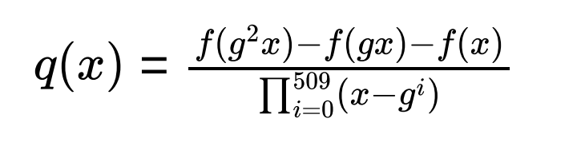

# Stark Theory

Topics to cover:
 - Error correcting codes
 - Computational Integrity
 - Overview of the STARK process
 - FRI

## Resources

[Whiteboard session about SNARKs vs STARKs](https://zkhack.dev/whiteboard)

## Error Correcting Codes

The basic idea is that we have a message, we add redundancy and this gives us a code word.

### Why do we want to do this?

We could be transmitting some message across a channel and there could be some interference along the way causing part of the message to be damaged or lost. Therefore, we want to redundancy in order to reconstruct the message. 

### Reed Solomon codes

[See introduction](http://pfister.ee.duke.edu/courses/ecen604/rspoly.pdf)

Reed-Solomon codes are systematic linear codes, meaning that the original data (message) is included as part of the encoded data (codeword), which also contains extra symbols.

A Reed-Solomon code is a set of length $n$ vectors (known as codewords), where the elements of the vector (known as symbols) consist of $m$ binary digits. Our only restriction is that $n$ must be chosen no larger than $2^m$. Of the $n$ symbols in each code word, $k$ of them carry information and the other $(n − k)$ are redundant symbols.

Assume that, of the total n symbols, exactly $t$ of them are received in error (and the other $n − t$ are received correctly).

Reed-Solomon codes have the remarkable property that if $t ≤ (n − k)/2$, then the correct information can be computed from this faulty codeword.

Furthermore, if $s$ of the received symbols are erased (i.e, tagged as probably being faulty) and
another $t$ symbols are received in error, the correct information can be computed from the faulty
code word provided that $s + 2t ≤ n − k$.

The device that reconstructs the information from the received vector is called a decoder.

The rate is $k/n$.

### Use of Polynomials

This extra data is calculated using polynomial arithmetic over a finite field.

Thus we have our message as coefficients in a polynomial of degree d

$A = a_0, a_1, . . a_(d−1)$

and we add redundancy by producing the evaluations of that polynomial at certain points

$A(1), A(w), A(w^2). . . A(w^(n−1))$ where $n >> d$

With FFTs we can quickly compute evaluations of polynomials.

[Resource](https://hackmd.io/@olivierbbb/By1dILSV8)

## Computational Integrity

One of the (remarkable) features of zero knowledge proof systems is that they can be used to prove that some computation has been done correctly.

For example if we have a cairo program that is checking that a prover knows the square root of 25, they can run the program to test this, but the verifier needs to know that the computation was done correctly.

The issue of succinctness is important here, we want the time taken to verify the computation to be substantially less than the time taken to execute the computation, otherwise the verifier would just repeat the computation.

With the Starknet L2 we are primarily concerned that a batch of transactions has executed correctly giving a valid state change. Participants on the L1, wish to verify this, without the need to execute all the transactions themselves.

In the context of Starknet, computational integrity is more important than zero knowledge, all data on Starknet is public.

## Overview of the Stark process

### Setup

Starks are transparent and therefore do not require an MPC ceremony to hide toxic waste.

The underlying cryptographic assumption is that we can use a collision resistant hash function. This means that STARKS are quantum secure, see this [answer](https://crypto.stackexchange.com/questions/99719/why-are-zk-stark-quantum-secure) from Stack Exchange for further details.

**Note: In Starknet, the prover is the Sequencer, verifier is the Verifier contract on L1 and the execution trace generated by the CairoVM compiler is the witness.**

We are interested in Computational Integrity (CI), for example knowing that the Cairo program you wrote was computed correctly.

We need to go through a number of transformations from the trace of our program, to the proof. The first part of this is called arithmetisation, it involves taking our trace and turning it into a set of polynomials.

Our problem then becomes one where the prover that attempts to convince a verifier that the polynomial is of low degree.

The verifier is convinced that the polynomial is of low degree if and only if the original computation is correct (except for an infinitesimally small probability).

Compared to SNARK arithmetisation, in a STARK our model is closer to a virtual machine.

### Arithmetisation

There are 2 steps:
1. Generating an execution trace and polynomial constraints
2. Transforming these two objects into a single low-degree polynomial.

The arithmetic intermediate representation (AIR) (also, arithmetic internal representation) is a way of describing a computation in terms of an execution trace that satisfies a number of constraints induced by the correct evolution of the state.

In terms of prover-verifier interaction, what really goes on is that the prover and the verifier agree on what the polynomial constraints are in advance.

The prover then generates an execution trace, and in the subsequent interaction, the prover tries to convince the verifier that the polynomial constraints are satisfied over this execution trace, unseen by the verifier.

The execution trace is a table that represents the steps of the underlying computation, where each row represents a single step. The type of execution trace that we’re looking to generate must have the special trait of being succinctly testable — each row can be verified relying only on rows that are close to it in the trace, and the same verification procedure is applied to each pair of rows.

For example imagine our program represents a running total, with each total being 5 more than the
previous value.

If we represent the row as $i$ , and the column as $j$, and the values as $A_i,_j$. We could write some contraints about this as follows:

$A_0,_1 = 0$
$∀1 <= i <= 5 : A_i,1 − A_(i−1),1 − 5 = 0$
$A_5,_1 = 25$

These are linear polynomial constraints in $A_i,_j$.

Note that we are getting some succinctness here because we could represent a much larger number of rows with just these 3 constraints.

We want a verifier to ask a prover a very small number of questions, and decide whether to accept or reject the proof with a guaranteed high level of accuracy.

Ideally, the verifier would like to ask the prover to provide the values in a few (random) places in the execution trace, and check that the polynomial constraints hold for these places.

A correct execution trace will naturally pass this test.

However, it is not hard to construct a completely wrong execution trace (especially if we knew beforehand which points would be tested) , that violates the constraints only at a single place, and, doing so, reach a completely far and different outcome.

Identifying this fault via a small number of random queries is highly improbable. But polynomials have some useful properties here:
 - Two (different) polynomials of degree d evaluated on a domain that is considerably larger than d are different almost everywhere.

So if we have a dishonest prover, that creates a polynomial of low degree representing their trace
(which is incorrect at some point) and evaluate it in a large domain, it will be easy to see that this is different to the correct polynomial (Schwartz-Zippel Lemma).

Our plan is therefore to:
1. Rephrase the execution trace as a polynomial
2. extend it to a large domain, and
3. transform that, using the polynomial constraints, into yet another polynomial that is guaranteed
to be of low degree if and only if the execution trace is valid.

In general if our computation involves $N$ steps, the execution trace will be represented by polynomials of degree less than $N$

$f(X) = c_0 + c_1X + c_2X_2 + ⋯ + c_(N−1)X_(N−1)$

"The coefficients $c_i$ are in the field F and the bound N on the degree is typically large, maybe of the order of a few million. Despite this, such polynomials are referred to as low degree.

This is because the point of comparison is the size of the field. By interpolation, every function on $F$ can be represented by a polynomial. Most of these will have degree equal to the full size of the field so, compared to this, $N$ is indeed low.

### STARK Arithmetisation

#### A more complex example

[See article](https://medium.com/starkware/arithmetization-ii-403c3b3f4355)

Imagine our code calculates the first 512 Fibonacci sequence

$1,1,2,3,5 ...$

If we decide to operate on a finite field with max number 96769 and we have calculated that the 512th number is 62215. Then our constraints are:

$A_0,_1 − 1 = 0$
$A_1,_1 − 1 = 0$
$∀0 <= i <= 510 : A_(i+2),1 = A_(i+1),1 + A_i,1$
$A_(511),1 − 62215 = 0$

#### Creating a polynomial for our trace

In order to efficiently prove the validity of the execution trace, we strive to achieve the following two goals:
1. Compose the constraints on top of the trace polynomials to enforce them on the trace.
2. Combine the constraints into a single (larger) polynomial, called the Composition Polynomial, so that a single low degree test can be used to attest to their low degree

We define a polynomial $f(x)$ such that the elements in the execution trace are evaluations of $f$ in
powers of some generator $g$.

Recall our finite field will have generators, we use these to index the steps of our trace.
Taking the fibonacci example from the medium [article](https://medium.com/starkware/arithmetization-ii-403c3b3f4355).

We can create constraints such as:

$∀ x ∈ {1, g, g^2, g^3. . . g^509}: f(g^2x) − f(gx) − f(x) = 0$

This constrains the values between subsequent rows. It also means that the g values are roots of this polynomial.

We can therefore use the approach we saw earlier to provide the vanishing polynomial by using the
term $(x − g^i)$ (term used by verifier to test prover).

and from this we create the composition polynomial

This equation reminds us of:
$Q(X).V(X) = P(X) => Q(X) = P(X) / V(X)$. 

From the basic fact about polynomials and their roots is that:
If $p(x)$ is a polynomial, then 
$p(a) = 0$ for some specific value $a$, 
if and only if there exists a polynomial $q(x)$ such that 
$(x − a)q(x) = p(x)$, and $deg(p) = deg(q) + 1$.

This expression agrees with the polynomial of degree at most 2 if our execution trace has been correct, i.e obeyed the step constraint that we defined.

If the trace differs from that, then this expression would be unlikely to produce a low degree polynomial.

#### Extending our polynomial

Polynomials can be used to construct good error correction codes, since two polynomials of degree d, evaluated on a domain that is considerably larger than d, are different almost everywhere.

Observing that, we can extend the execution trace by thinking of it as an evaluation of a polynomial on some domain, and evaluating this same polynomial on a much larger domain. Extending in a similar fashion an incorrect execution trace, results in a vastly different string, which in turn makes it possible for the verifier to distinguish between these cases using a small number of queries.

## From Polynomial Constraints to Low Degree Testing Problem

In general if our computation involves $N$ steps, the execution trace will be represented by polynomials of degree less than $N$

$f(X) = c_0 + c_1X + c_2X_2 + ⋯ + c_(N−1)X_(N−1)$

"The coefficients $c_i$ are in the field F and the bound N on the degree is typically large, maybe of the order of a few million. Despite this, such polynomials are referred to as low degree.

This is because the point of comparison is the size of the field. By interpolation, every function on $F$ can be represented by a polynomial. Most of these will have degree equal to the full size of the field so, compared to this, $N$ is indeed low.

Such functions, consistent with a low degree polynomial, are also known as Reed–Solomon codes.

Following the generation of the trace, the prover commits to it. Recall that we don't want to send the polynomials to the verifier as a whole, but we need the prover
to commit to them.

Throughout the system, commitments are implemented by building Merkle trees over the series of
field elements and sending the Merkle roots to the verifier

We want a verifier to ask a prover a very small number of questions, and decide whether to accept
or reject the proof with a guaranteed high level of accuracy.

Ideally, the verifier would like to ask the prover to provide the values in a few (random) places in the execution trace, and check that the polynomial constraints hold for these places. A correct execution trace will naturally pass this test.

However, it is not hard to construct a completely wrong execution trace (especially if we knew
beforehand which points would be tested) , that violates the constraints only at a single place, and,
doing so, reach a completely far and different outcome.

Identifying this fault via a small number of random queries is highly improbable.

But recall that polynomials have some useful properties here. Two (different) polynomials of degree d evaluated on a domain that is considerably larger than d are different almost everywhere.

So if we have a dishonest prover, that creates a polynomial of low degree representing their trace
(which is incorrect at some point) and evaluate it in a large domain, it will be easy to see that this is different to the correct polynomial.

A good example of this process is provided in [these](https://www.sikoba.com/docs/zklux1_slides_dmitry.pdf) slides.

## Low degree testing

Low degree testing really is the heart of the verification process.

### In general

The low degree testing assumption states the existence of a probabilistic verifier that checks whether a function $f$ is of degree at most $d ≪ |F|$.

The verifier needs to distinguish between the following two cases.

1. The function $f$ is equal to a low degree polynomial.
  - Namely, there exists a polynomial $p(x)$ over $F$, of degree less than d, that agrees with $f$ everywhere.
2. The function $f$ is far from ALL low degree polynomials.
  - For example, we need to modify at least 10% of the values of $f$ before we obtain a function that agrees with a polynomial of degree less than $d$.

Arithmetization shows that an honest prover dealing with a true statement will land in the first case, whereas a (possibly malicious) prover attempting to “prove” a false claim will land, with high
probability, in the second case. 

Another way to look at this is that the correct trace polynomial combined with the constraints will necessarily of low degree, the degree coming from the number of steps in our trace (probably a few million), and the combination of this with the constraint polynomials (probably < 10).

Overall we would expect the 'correct' polynomials to be of degree around $10^7$, whereas a cheating
prover who picked points at random from the field F would after interpolation get polynomials of
degree comparable to the size of the field, i.e of the order of 2 to the power of 256

## FRI

FRI stands for  Fast Reed-Solomon IOP of Proximity, it is a protocol that establishes that a committed polynomial has a bounded degree.

[See Risc0 video](https://www.youtube.com/watch?v=ySlibAm9IVM)
[See their overview as well](https://www.youtube.com/watch?v=wqRuoyH3Mqk)

In short, it gives us the feature of PCS (Polynomial Commitment Schemes), which the verifier can use to make a decision. 

[See how FRI works in STARKs](https://aszepieniec.github.io/stark-anatomy/). This resource also talks about the split and fold technique. 
[ZK Study Club Slides](https://docs.google.com/presentation/d/1YJX_MgWjhsFHiubHoCMb5F27rtN9AcxgaKMswGFf8I4/edit#slide=id.g6bbfe4127e_0_693)

## Fiat Shamir Heuristic

The final part of the process is to make our proof non interactive, to understand the process I find
thinking in terms of interaction helps, and the final part is just squashing this interaction into one step. For this we use the ubiquitous Fiat Shamir Heuristic.

### Public coin protocols

This terminology simply means that the verifier is using randomness when sending queries to the prover , i.e. like flipping a coin.

### Random oracle model

Both parties are given blackbox access to a random function.

### Fiat Shamir Heuristic

In an interactive process, the prover and a verifier engage in a multiple interactions, such as in the billiard ball example, to verify a proof.

However, this interaction may not be convenient or efficient, with blockchains, we would like only a
single message sent to a verifier smart contract to be sufficient.

The Fiat-Shamir heuristic addresses this limitation by converting an interactive scheme into a non-interactive one, where the prover can produce a convincing proof without the need for interactive
communication. This is achieved by using a cryptographic hash function.

The general process is:
1. Setup: The verifier generates a public key and a secret key. The public key is made public, while the secret key remains private.
2. Commitment: The verifier commits to a randomly chosen challenge, typically by hashing it together with some additional data. The commitment is sent to the prover.
3. Response: The prover uses the commitment received from the verifier and its secret key to compute a response. The response is generated by applying the cryptographic hash function
to the commitment and the prover's secret key.
4. Verification: The verifier takes the prover's response and checks if it satisfies certain conditions. These conditions are typically defined by the original scheme.

The Fiat-Shamir heuristic is secure under the assumption that the underlying identification scheme
is secure and the cryptographic hash function used is collision-resistant. It provides a way to convert interactive protocols into more efficient and practical non-interactive ones without
compromising security.

When the prover and verifier are interacting, there are a small number of queries from the verifier
that would allow the prover to cheat, because we don't have complete soundness.

In the Fiat Shamir heuristic we assume that the prover is computationally bounded (i.e this is an
argument of knowledge as opposed to a proof).