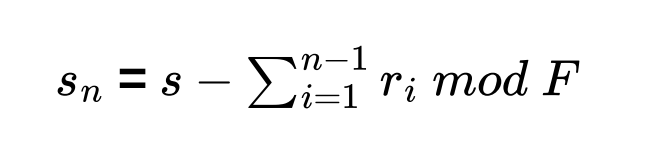
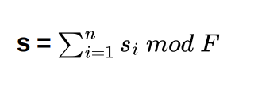
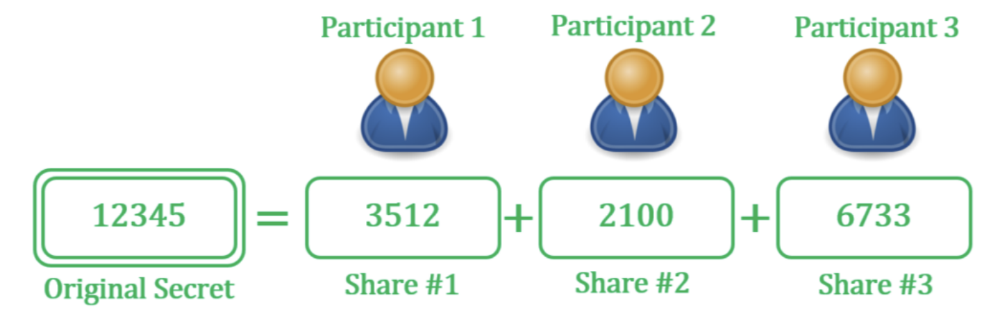

# Cryptographic alternatives

Topics:
 - Lurk language
 - Shamir secret sharing
 - MPC
 - Sigma protocols
 - Proxy re encryption
 - Confidential transactions
 - Voting systems

## Lurk Language

[See blog](https://filecoin.io/blog/posts/introducing-lurk-a-programming-language-for-recursive-zk-snarks/?s=09)

Lurk is a Turing-complete language produced by Filecoin to allow creation of recursive zk-SNARKs.

It is a statically scoped dialect of [Lisp](https://en.wikipedia.org/wiki/Lisp_%28programming_language%29).

Features: 
 - Verifiable computation
 - Succinct proofs
 - Zero knowledge
 - Turing-completeness
 - Arbitrary traversal of content-addressable data
 - Higher-order functions (e.g. functions as public inputs to computations, with proof)
 - Content-addressable data for natural integration with IPFS and IPLD

## Secret Sharing

The goal in secret sharing is to divide secret $S$ into n pieces of data $S_i. . S_n$ in such a way that:

Knowledge of any $k$ or more $S_i$ pieces makes $S$ easy to compute. That is, the complete secret $S$
can be reconstructed from any combination of k pieces of data.

Knowledge of any $k − 1$ or fewer $S_i$ pieces leaves $S$ completely undetermined, in the sense that the possible values for $S$ seem as likely as with knowledge of 0 pieces.

A naive splitting of a key would just make a brute force attack easier.

## Shamir Secret Sharing

Based on the fact the $k$ points are required to define a polynomial of degree $k − 1$.  With our points being elements in a finite field $F$ of size $P$ where $0 < k <= n < P; S < P$ and $P$ is
a prime number.

Choose at random $k − 1$ positive integers $a_1. . a_(k−1)$ with $a_i < P$ and let $a_0 = S$

The person splitting the secret builds a polynomial where the secret is the constant term $a_0$

$f(x) = a_0 + a_1x + a_2x^2+. . . + a_(k−1)x^(k−1)$

Let us construct any n points out of it, for instance set $i = 1.. n$ to retrieve $(i, f(i))$.

Every participant is given a point (a non-zero integer input to the polynomial, and the corresponding integer output) along with the prime which defines the finite field to use. Given any subset of $k$ of these pairs, we can find the coefficients of the polynomial using interpolation. The secret is the constant term $a_0$.

### Properties of Shamir's $(k, n)$ threshold scheme are:

 - Secure: Information theoretic security.
 - Minimal: The size of each piece does not exceed the size of the original data.
 - Extensible: When $k$ is kept fixed, $D_i$ pieces can be dynamically added or deleted without affecting the other pieces.
 - Dynamic: Security can be easily enhanced without changing the secret, but by changing the polynomial occasionally (keeping the same free term) and constructing new shares to the participants.
 - Flexible: In organizations where hierarchy is important, we can supply each participant different number of pieces according to their importance inside the organization. For instance, the president can unlock the safe alone, whereas 3 subordinates are required together to unlock it.

### Additive Secret Sharing

Given a secret $s ∈ F$, the dealer D selects $n − 1$ random integers.

$R = r_1, r_2, r_(n−1)$ uniformly from $F$.

D then computes

D sends each player $P_i$, $1 ≤ i ≤ n − 1$, the share $s_i = r_i$, and the share $s_n$ is sent to $P_n$.

The reconstruction of secret $s ∈ F$ is trivial; simply add all of the shares together:

The above additive secret sharing scheme requires all participants to contribute their shares in order to reconstruct the secret.

If one or more of the participants are missing, no information about the original secret can be recovered; such a scheme is known as a perfect secret sharing scheme.

## Multi party computation (MPC)

### Overview

(Also known as secure multiparty computation SMPC)

Most MPC protocols make use of a secret sharing scheme such as Shamir Secret Sharing.

Note the difference between MPC and secret sharing, in MPC, bring together the shares does not
give the secret, rather it provides the input to a computation. A key point to understand is that MPC is not a single protocol but rather a growing class of solutions that differ with respect to properties and performance. However, common for most MPC systems are the three basic roles:

 - The Input Parties delivering sensitive data to the confidential computation.
 - The Result Parties receiving results or partial results from the confidential computation.
 - The Computing Parties jointly computing the confidential computation

In an multi party computation, a given number of participants, $p_1, p_2,…p_n$, each have private data, respectively $d_1, d_2,…d_n$.

Participants want to compute the value of a public function on that private data: $f(d_1, d_2 …d_n)$ while keeping their own inputs secret.

The function $f(d_1, d_2 …d_n)$ is used to define an arithmetic circuit over a finite field which consists of addition and multiplication gates.

In the secret sharing based methods, the parties do not play special roles. Instead, the data associated with each wire is shared amongst the parties, and a protocol is then used to evaluate each gate.

Two types of secret sharing schemes are commonly used;
1. Shamir secret sharing
2. Additive secret sharing

In both cases the shares are random elements of a finite field that add up to the secret in the
field; intuitively, security is achieved because any non-qualifying set of shares looks randomly
distributed.

[See article](https://blog.pantherprotocol.io/a-deep-dive-into-secure-multi-party-computation-mpc/)

### Timeline of MPC

 - 1982 – 1986: To solve the famous [Millionaire's Problem](https://en.wikipedia.org/wiki/Yao%27s_Millionaires%27_problem?ref=panther-protocol-blog), Andrew Yao introduced two-party computation and adapted it to any calculation involving two parties.
 - 1987: Oded Goldreich, Silvio Micali, and Avi Wigderson release the [Goldreich-MicaliWigderson protocol](https://wiki.mpcalliance.org/gmw.html?ref=panther-protocol-blog), adapting two-party computation to a multi-party format.
 - The 1990s: More studies on MPC technology resulted in several breakthroughs, one of which was enabling the computation to run on mobile (i.e. less powerful) devices.
 - 2008: The first practical application of MPC at scale occurred in a [sealed-bid sugar beet auction](https://csrc.nist.gov/csrc/media/events/meeting-on-privacy-enhancing-cryptography/documents/toft.pdf?ref=panther-protocol-blog) in Denmark.
 - 2015: Following an increase in hacks and thefts from crypto wallets, crypto wallet providers and custodians begin utilizing MPC for private key and digital asset security.
 - 2019: The [MPC-CMP](https://www.fireblocks.com/blog/pushing-mpc-wallet-signing-speeds-8x-with-mpc-cmp-9/?ref=panther-protocol-blog) debuted as the first automatic, one-round key-refreshing MPC algorithm.

### Use Cases

[1kx article on seedless self-custody](https://medium.com/1kxnetwork/wallets-91c7c3457578)

MPC wallets differ from multisig wallets.

A multisig wallet uses a unique digital signature that requires more than one private key to
authenticate an outgoing transaction, while an MPC wallet divides a single private key among
multiple parties. Note that naive splitting of the private key would reduce the security of the wallet.

MPC allows the creation of a secure key management system without a private key which would
represent a single point of failure.

Instead multiple parties or a single party with multiple devices can collaborate on the functions
needed such as signing and verifying transactions, but none of the parties need reveal their 'share'
of the secret.

**Examples:**

[See Zen Go MPC](https://zengo.com/)

[See Lit Network blog](https://litprotocol.notion.site/Lit-Protocol-Use-Cases-a94916becdc0411f848c3095722c7864)

[See Lit Network docs](https://developer.litprotocol.com/v2/)

Lit Protocol is a distributed key management network that providers developers with two main
services: encryption and programmable signing.

#### MPC Wallet Solution

[See documentation](https://developer.litprotocol.com/v2/concepts/pkpsAsWallet)

In the context of key management, MPC can be used to generate distributed shares of a public/private key pair (which can be utilized for encryption and signing), without ever exposing the private key in its entirety. This means no one party ever has full control over the underlying key pair, eliminating single points of failure that exist in "centralized" key management ecosystems.

#### Genetic Testing

See [Survey of Secure Multiparty Computation Protocols for Privacy Preserving Genetic Tests](https://ieeexplore.ieee.org/document/7545831). Patients can access their genetic profiles privately and securely without revealing any confidential information.

#### Resources

See this [article](http://twistedoakstudios.com/blog/Post3724_explain-it-like-im-five-the-socialist-millionaire-problem-and-secure-multi-party-computation) for an explanation of Yao's Millionaire problem (The problem discusses two millionaires, Alice and Bob, who are interested in knowing which of them is richer without revealing their actual wealth.)

[Curated list](https://github.com/rdragos/awesome-mpc) of MPC resources
[Guide to MPC](https://blog.pantherprotocol.io/a-deep-dive-into-secure-multi-party-computation-mpc)

## Sigma Protocols

[See article](https://medium.com/@loveshharchandani/zero-knowledge-proofs-with-sigma-protocols-91e94858a1fb)

## Proxy Re-encryption

[See Threshold Network Documentation](https://docs.threshold.network/applications/threshold-access-control)

## Confidential transactions

This work was originally proposed by Adam Back on Bitcointalk in his 2013 thread [“bitcoins with
homomorphic value”](https://bitcointalk.org/index.php?topic=305791.0).

"To build CT I had to implement several new cryptosystems which work in concert, and invented a
generalization of ring signatures and several novel optimizations to make the result reasonably
efficient."

The basic tool that CT is based on is a Pedersen commitment.

A commitment scheme lets you keep a piece of data secret but commit to it so that you cannot change it later. A simple commitment scheme can be constructed using a cryptographic hash:

`commitment = SHA256( blinding_factor || data )`

If you tell someone only the commitment then they cannot determine what data you are committing to (given certain assumptions about the properties of the hash), but you can later reveal both the data and the blinding factor and they can run the hash and verify that the data you committed to matches.

The blinding factor is present because without one, someone could try guessing at the data; if your data is small and simple, it might be easy to just guess it and compare the guess to the commitment.

A Pedersen commitment works like the above but with an additional property (homomorphism): commitments can be added, and the sum of a set of commitments is the same as a commitment to the sum of the data (with a blinding key set as the sum of the blinding keys):

`
C(BF1, data1) + C(BF2, data2) == C(BF1 + BF2, data1 + data2)
C(BF1, data1) - C(BF1, data1) == 0
`

In other words, the commitment preserves addition and the commutative property applies.

If $data_n = 1, 1, 2$ and $BF_n = 5, 10, 15$ then:

`C(BF1, data1) + C(BF2, data2) - C(BF3, data3) == 0`

For a workable cryptocurrency systems, range proofs would also be needed.

See the [Liquid Network](https://help.blockstream.com/hc/en-us/sections/900000129806-Understanding-Liquid) which uses confidential transactions by default.

You can see details on their [block explorer](https://blockstream.info/liquid/tx/13f0e0a40208a6b3057d0c05770c026ec46702853c99ef48d698ea20fa6fbac2).

## Voting Systems

### A Problem with rewarding users in voting systems

Imagine a system where users can vote with tokens (which they retain) and are rewarded for the
number of votes they receive in a period.

Suppose that some wealthy user acquires some quantity N of tokens, and as a result each of the
user's k votes gives the recipient a reward of N ⋅ q (q here probably being a very small number, eg.
think q = 0.000001).

The user simply upvotes their own sockpuppet accounts, giving themselves the reward of N ⋅ k ⋅ q.
Then each user has an "interest rate" of k ⋅ q per period.

See [collusion article](https://vitalik.ca/general/2019/04/03/collusion.html) and [Governance](https://vitalik.ca/general/2017/12/17/voting.html) by Vitalik.

### Bribery in voting Systems

Suppose Alice can vote for a project to receive a grant.

If Charlie has a candidate project he may want to bribe Alice to vote for his project, he could do this via a side channel, and it would be unknown to the voting system.

A partial way around this is to encrypt the votes, so that if Alice's vote is seen in the system, we
cannot tell which project she voted for.

To do this Alice could use some key, however if the encrypted vote is public, Alice could send the
details of how she voted to Charlie, who could verify it, and Alice could claim her bribe.

A further refinement is then to allow Alice to vote multiple times, revoking the previous key she
used, effectively invalidating the previous vote.

In this case Charlie loses the confidence that he has in the information that Alice sends him, as he
knows she could have accepted his bribe, then later voted for someone else (and maybe get a bribe from them etc.)

MACI uses this approach, plus ZKPs to create an infrastructure that mitigates the effect of
collusion.

### Minimal Anti-Collusion Infrastructure (MACI)

See:
[Repo](https://github.com/appliedzkp/maci#minimal-anti-collusion-infrastructure)
[Discussion](https://ethresear.ch/t/minimal-anti-collusion-infrastructure/5413/6)
[ZK Podcast](https://zeroknowledge.fm/159-2/)

The process of implementing this in a smart contract (taken from repo):

Whitelisted voters named Alice, Bob, and Charlie register to vote by sending their public key to a smart contract. Additionally, there is a central coordinator Dave, whose public key is known to all.

When Alice casts her vote, she signs her vote with her private key, encrypts her signature with Dave's public key, and submits the result to the smart contract.

Each voter may change her keypair at any time. To do this, she creates and signs a key-change command, encrypts it, and sends it to the smart contract. This makes it impossible for a briber to
ever be sure that their bribe has any effect on the bribee's vote.

If Bob, for instance, bribes Alice to vote a certain way, she can simply use the first public key she
had registered — which is now void — to cast a vote. Since said vote is encrypted, as was the keychanging message which Alice had previously sent to Dave, Bob has no way to tell if Alice had indeed voted the way he wanted her to.

Even if Alice reveals the cleartext of her vote to Bob, she just needs to not show him the updated
key command that she previously used to invalidate that key. In short, as long as she had submitted
a single encrypted command before her vote, there is no way to tell if said vote is valid or not.

### Quadratic Voting

This is not ZK-specific but used in crypto in general.

Quadratic voting works by allowing users to "pay" for additional votes on a given matter to express
their support for given issues more strongly, resulting in voting outcomes that are aligned with the
highest willingness to pay outcome, rather than just the outcome preferred by the majority regardless of the intensity of individual preferences.

A general drawback to these ideas occurs where the number of votes cast is small.

## Blind signatures

The notion of blind signatures was introduced by Chaum in 1982. There are two properties which any blind signature scheme must satisfy: Blindness and Untraceability.

 - Blindness means the content of a message should be blind to the signer.
 - Untraceability is satisfied if, whenever a blind signature is revealed to the public, the signer will be unable to know who the owner of the signature is

An often-used analogy to the cryptographic blind signature is the physical act of a voter enclosing a
completed anonymous ballot in a special carbon paper lined envelope that has the voter's credentials pre-printed on the outside.

An official verifies the credentials and signs the envelope, thereby transferring his signature to the ballot inside via the carbon paper.

Once signed, the package is given back to the voter, who transfers the now signed ballot to a new
unmarked normal envelope.

Thus, the signer does not view the message content, but a third party can later verify the signature
and know that the signature is valid within the limitations of the underlying signature scheme.

Blind signature is a kind of digital signature in which the message is blinded before it is signed.
Therefore, the signer will not learn the message content. Then the signed message will be unblinded.
At this moment, it is similar to a normal digital signature, and it can be publicly checked against the original message.

Blind signature can be implemented using a number of public-key encryption schemes.

Here, we only introduce the simplest one, which is based on RSA encryption.

The signer has a public key $(n, e)$ and $a$ secret key $d$.

Suppose a party A wants to have a message m signed using the blind signature.

She should execute the protocol with the signer S as follows:

A first randomly chooses a value $k$, which satisfies $0 ≤ k ≤ n − 1$ and $gcd(n, k) = 1$.

For the message $m$, A computes $m* = mk^e(mod n)$ and sends $m*$ to $S$.

When $S$ receives $m*$, $S$ computes $s* = (m*)d (mod n)$ and sends $s*$ back to A.

A computes $s = s* /k (mod n)$.

Now $s$ is S's signature on the message $m$.

### Semaphore

[Docs](https://semaphore.appliedzkp.org/docs/introduction)
[Repo](https://github.com/semaphore-protocol/semaphore)

Semaphore  is a zero-knowledge protocol that allows you to cast a signal (for example, a vote or endorsement) as a provable group member without revealing your identity.

Use cases include private voting, whistleblowing, anonymous DAOs and mixers.